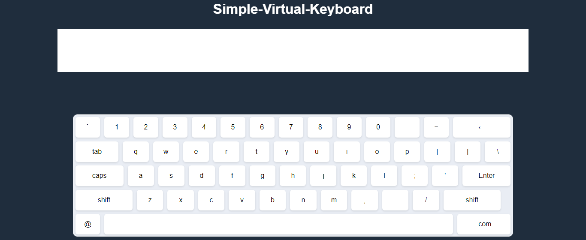

# Virtual Keyboard

This repository contains a simple virtual keyboard implemented using HTML, CSS, and JavaScript.
## Preview

<h2>Overview</h2>

The virtual keyboard provides an on-screen representation of a standard keyboard layout using HTML elements styled with CSS. It allows users to simulate typing and input characters without a physical keyboard. The functionality is implemented using JavaScript to handle keypress events and update the displayed text accordingly.

## Features

- Basic representation of a QWERTY keyboard layout
- Simulates keypress events for each key displayed
- Responsive design for various screen sizes

## Usage

To use the virtual keyboard:

1. Clone this repository to your local machine.
2. Open the `index.html` file in your web browser.
3. Click on the virtual keys to simulate typing.
## Contributing

Contributions are welcome! Feel free to fork this repository, make changes, and create a pull request. For major changes, please open an issue first to discuss the proposed modifications.
